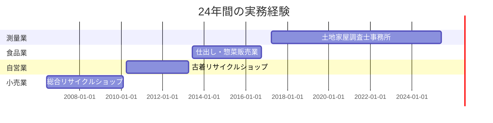

<h1 align="center">
  
</h1>

<p align="center">
  
  
  
</p>

<p align="center">
  <b>📊 データ分析 | 🤖 機械学習・AI | ⚡ 業務効率化</b>
</p>

---

## 🚀 Featured Projects

<table>
<tr>
<td width="50%">

### 📁 File Search App
実務で使える高速ファイル検索アプリケーション

**Tech Stack:**
- Python
- GUI開発

[](https://github.com/YOUR_USERNAME/file-search-app)

</td>
<td width="50%">

### 🤖 AI Project
機械学習を活用したPC操作支援アプリ

**Highlights:**
- 192,000枚の画像データセット作成
- 12クラスの画像認識

[](https://github.com/YOUR_USERNAME/AI)

</td>
</tr>
<tr>
<td width="50%" colspan="2">

### 📍 GPS SCAN
位置情報を活用したスキャンアプリケーション

**Features:**
- GPS機能の実装
- データ処理と可視化

[](https://github.com/YOUR_USERNAME/GPSSCAN)

</td>
</tr>
</table>

---

## 👨‍💻 About Me

```python
class DaisukeIkeda:
    def __init__(self):
        self.age = 44
        self.current_status = "転職活動中 & 職業訓練受講中"
        self.training_period = "2025年6月〜12月"
        self.passion = "20時間連続コーディング"
        
    def background(self):
        return {
            "測量業務": "年間40〜80件の境界確定・登記（8年3ヶ月）",
            "デジタルマーケティング": "SNS集客で月間60件の新規顧客獲得",
            "マネジメント": "グループ9店舗中、売上伸び率1位達成",
            "起業経験": "古着リサイクルショップ経営（3年間）"
        }
    
    def interests(self):
        return ["データ分析", "機械学習", "業務効率化", "AI活用"]
```

**💡 プログラミング学習への情熱**
- 休日には**20時間連続でコードを書き続ける**ほど没頭
- 生成AIを活用しながら「なぜこのコードが必要か」を理解しながら学習
- 理論と実践の両方を重視した学習スタイル

---

## 💻 Tech Stack

### 🎓 訓練校で学習中
<p>
  
  
  
  
  
  
  
</p>

### 📚 独学で習得中
<p>
  
  
  
  
  
</p>

### 🛠️ その他のスキル
<p>
  
  
  
</p>

---

## 📚 Learning Journey

<details>
<summary><b>📖 走破済みの書籍（9冊）</b></summary>

### 基礎固めとして読破
- ✅ Python 1年生 - 基礎構文・変数・関数
- ✅ Python 2年生 スクレイピング - Beautiful Soup・requests
- ✅ Python 2年生 データ分析 - pandas・matplotlib
- ✅ Python 3年生 機械学習 - scikit-learn入門
- ✅ Python 3年生 ディープラーニング - ニューラルネットワーク入門
- ✅ データサイエンス 1年生 - データ分析の基礎
- ✅ SQL 1年生 - データベース基礎
- ✅ JavaScript 1年生 - Web開発の基礎
- ✅ ChatGPTプログラミング 1年生 - AI活用の基礎

</details>

<details>
<summary><b>📚 現在学習中のオライリー技術書（4冊）</b></summary>

### より実践的な技術習得のため
- 🔄 入門 Python 3
- 🔄 Pythonではじめる機械学習
- 🔄 退屈なことはPythonにやらせよう
- 🔄 ゼロから作るDeep Learning

</details>

<details>
<summary><b>📖 現在学習中の入門書（3冊）</b></summary>

### 幅広い技術の習得
- 🔄 Java 1年生
- 🔄 Python 2年生 アプリ開発の仕組み
- 🔄 AWS 1年生 クラウドのしくみ

</details>

**📊 合計16冊の技術書に取り組み中**

---

## 💼 Work Experience Timeline



### 主な実績
| 期間 | 職種 | 主な成果 |
|------|------|----------|
| 2017-2025 | 測量業務担当 | 年間40〜80件の境界確定・登記業務 |
| 2013-2016 | 経営統括 | SNS集客で月間60件の新規顧客獲得 |
| 2010-2013 | 経営者（自営） | Webページ制作の基礎技術習得 |
| 2006-2010 | 店舗責任者 | グループ9店舗中、売上伸び率1位 |

---

## 📊 GitHub Stats

<p align="center">
  
  
</p>

<p align="center">
  
</p>

---

## 🎓 Certifications

<table>
  <tr>
    <td align="center" width="33%">
      
      <br><b>測量士補</b>
      <br><sub>2021年1月</sub>
    </td>
    <td align="center" width="33%">
      
      <br><b>普通自動車免許</b>
      <br><sub>2001年6月</sub>
    </td>
    <td align="center" width="33%">
      
      <br><b>普通自動二輪免許</b>
      <br><sub>2001年6月</sub>
    </td>
  </tr>
</table>

---

## 🎯 Current Goals

- [ ] オライリー技術書4冊の完読
- [ ] 機械学習プロジェクトのポートフォリオ拡充
- [ ] データ分析・AI分野での転職成功
- [ ] Kaggleコンペティションへの参加
- [ ] 技術ブログの開設

---

## 📫 Let's Connect!

<p align="center">
  現在、<b>転職活動中</b>です。<br>
  データ分析・機械学習・業務効率化の分野でのご縁をお待ちしております。
</p>

<p align="center">
  <a href="https://github.com/YOUR_USERNAME">
    
  </a>
  <a href="mailto:d.i.a.0101@gmail.com">
    
  </a>
  <a href="https://YOUR_USERNAME.github.io">
    
  </a>
</p>

---

<p align="center">
  
</p>

<h3 align="center">💡 "44歳からのIT挑戦、継続中です"</h3>

<p align="center">
  
</p>
