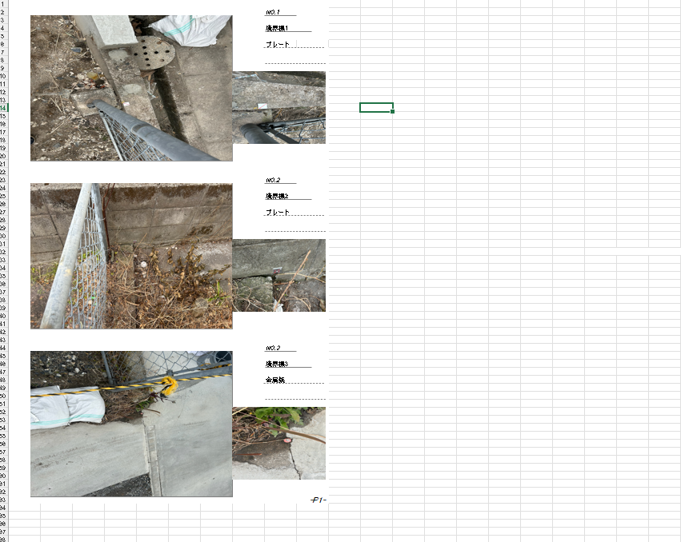

  

<h1 align="center">
  
</h1>

  <b>実務で培った問題発見力 × プログラミング技術</b> 
  業務効率化・アプリ開発・システム自動化

  
  
  
  

---

## 🚀 Featured Project

### 📊 測量報告書作成自動化システム

**8年間の測量業務経験から生まれた、業務全体を自動化する統合システム**

#### 解決した課題

測量業務において、以下の課題がありました：
- 写真内容（遠景/近景など）を目視で判別する必要がある
- 報告書に写真を1枚ずつ手作業で配置する必要がある
- 測量画像の管理が煩雑で時間がかかる

この作業は1件あたり**数時間かかっていました**。年間40〜80件の業務で大きな負担となっていたため、**3つのサブシステムを連携させた完全自動化システム**を開発しました。

---

#### 💡 開発プロセス

このシステムは、以下のアプローチで開発しました：

1. **実務経験からの課題抽出**
   - 8年間の測量業務で実際に直面した課題を分析
   - 業務フロー全体を理解し、システム要件を定義

2. **生成AI（Claude/ChatGPT）の活用**
   - 定義した要件をもとに、生成AIを使って効率的にコードを生成
   - 現代的なツールを活用した開発手法を実践

3. **コードレビューと学習**
   - 生成されたコードを読解し、仕組みを理解
   - 必要に応じてカスタマイズや改善を実施

4. **技術書による理論補完**
   - オライリー技術書で基礎理論を学習
   - 実装の裏付けとなる知識を体系的に習得

**学習姿勢**: 生成AIで作成したコードを理解するために、現在も継続して技術書で学習中です。

---

#### システム構成

業務フローに沿った3段階の自動化を実現：

---

**ステップ1: GPSSCAN（写真リネーム自動化）**

SIMファイル（測量データ）とGPS情報から、写真を測量点に自動マッチング。体系的なファイル名に一括リネーム。

**主な機能:**
- SIMファイル解析（A01/A02/D00形式対応）
- GPS座標の自動平面直角座標変換（EPSG:6669-6687）
- ドラッグ&ドロップによる直感的なマッチングUI
- 測量点・地番境界の地図可視化

**技術:** `Python` `Tkinter` `Matplotlib` `pyproj` `pandas` `OpenCV`

  

---

**ステップ2: AI画像認識（写真分類自動化）**

機械学習により、写真の内容を自動判別。遠景/近景などを自動分類し、次のステップに必要な情報を付与。

**技術的な取り組み:**
- 192,000枚の画像データセット作成（12クラス × 各16,000枚）
- TensorFlow/Kerasによるディープラーニングモデル構築
- データ拡張による汎化性能向上

**技術:** `Python` `TensorFlow/Keras` `OpenCV` `scikit-learn`

  

---

**ステップ3: 自動写真アルバム（報告書配置自動化）**

Excel VBAにより、整理された写真を報告書フォーマットに自動配置し、最終的な測量報告書を完成させます。

**実装内容:**
- 測量点ごとに写真を自動配置
- 遠景/近景の配置位置を自動判定
- 報告書フォーマットに準拠した体裁調整

**技術:** `Excel VBA` `マクロ自動化`

**自動化の様子:**

  

**完成例（ビフォー・アフター）:**

  

> **※業務データを含むため、リポジトリは非公開としています**

---

#### 成果

- **作業時間**: 数時間 → 数分に短縮
- **適用業務数**: 年間40〜80件
- **システム連携**: 3つのサブシステムによる統合ワークフロー

---

## 💼 Other Projects

### 📁 高速ファイル検索アプリ

**課題:** 測量資料を紙ベースで保管していたため、保管場所と書類管理が大変

**解決策:** PDFやワード、エクセルの内容を読み取りデータベース化し、検索文字でタイトルと内容の両方検索できるようにしているため管理、保管がしやすくなった。

**主な機能:**
- PDF、Word、Excelファイルの自動テキスト抽出
- ファイル名とファイル内容の両方を対象とした高速検索
- データベース化による効率的な文書管理
- 直感的なGUIによる簡単操作

**技術:** `Python` `Tkinter` `sqlite3` `PyPDF2` `python-docx` `openpyxl`

  

---

## 💻 Tech Stack

### 言語

### フレームワーク・ライブラリ

### ツール・開発手法

---

## 👨‍💻 About Me

**公共職業訓練（2025年6月〜12月）**にてプログラミング技術を習得中。
24年間の実務経験と技術力を掛け合わせ、企業の課題解決に貢献できる人材を目指しています。

### 強み

- **実務課題の特定**: 8年間の測量業務経験から、解決すべき課題を明確化
- **生成AIの活用**: Claude/ChatGPTを使って効率的にコードを生成
- **コードレビュー**: 生成されたコードの仕組みを理解し、カスタマイズ
- **理論と実践の両立**: オライリー技術書で理論を学び、実装で検証
- **システム設計力**: 複数の技術を統合し、業務フロー全体を最適化

**現代的な開発手法**: 生成AIを活用しながら、技術書で基礎を固める学習アプローチを実践しています。

---

## 💼 Work Experience

### 🏗️ 測量業務（8年3ヶ月）
**土地家屋調査士事務所 | 2017年4月 〜 2025年6月**

- 年間40〜80件の境界確定・登記業務を担当
- 測量士補資格取得（2021年1月）
- 業務フロー全体を理解し、自動化システムの設計・開発に活用

### 🍱 食品業界（3年4ヶ月）
**仕出し・惣菜販売業（経営統括）| 2013年6月 〜 2016年10月**

- SNS集客で月間60件の新規顧客獲得
- デジタルマーケティングの実践経験

### その他の経験

| 期間 | 職種 | 主な成果 |
|------|------|----------|
| 2010-2013 | 古着リサイクルショップ経営 | Webページ制作の基礎習得 |
| 2006-2010 | 総合リサイクルショップ店舗責任者 | グループ9店舗中売上伸び率1位達成 |

---

## 📊 GitHub Stats

  
  

  

---

## 📚 継続的な学習

<b>現在学習中の技術書</b>

### 学習アプローチ

**生成AI × 技術書の相乗効果**
- 生成AIで作成したコードを読解し、仕組みを理解
- オライリー技術書で基礎理論を体系的に学習
- 学んだ知識を即座にプロジェクトで実装・検証

### オライリー技術書（4冊）
- 入門 Python 3
- Pythonではじめる機械学習
- 退屈なことはPythonにやらせよう
- ゼロから作るDeep Learning

### 入門書（12冊）
**完読済み（9冊）:**
- Python 1年生 / 2年生（スクレイピング・データ分析）/ 3年生（機械学習・ディープラーニング）
- データサイエンス 1年生、SQL 1年生、JavaScript 1年生
- ChatGPTプログラミング 1年生

**学習中（3冊）:**
- Java 1年生、Python 2年生 アプリ開発、AWS 1年生

**学習方針**: 理論だけでなく、学んだ知識を即座にプロジェクトで実装

---

## 🎯 Current Goals

- 生成AIで作成したコードの完全理解
- オライリー技術書の完読と実践
- 業務自動化システムのポートフォリオ拡充
- 業務効率化・システム開発分野での転職成功

---

## 🎓 保有資格

<table>
  <tr>
    <td align="center" width="33%">
      
       <b>測量士補</b>
       2021年1月
    </td>
    <td align="center" width="33%">
      
       <b>普通自動車免許</b>
       2001年6月
    </td>
    <td align="center" width="33%">
      
       <b>普通自動二輪免許</b>
       2001年6月
    </td>
  </tr>
</table>

---

## 📫 Contact

  現在、<b>業務効率化・アプリ開発・システム自動化</b>分野での転職活動中です。 
  24年間の実務経験と技術力で、企業の課題解決に貢献します。

  
  
  

---

  <h3>💡 "Experience Meets Technology"</h3>
  

    <em>24年の実務経験 × プログラミング技術で価値を創造します。</em>
  

  

